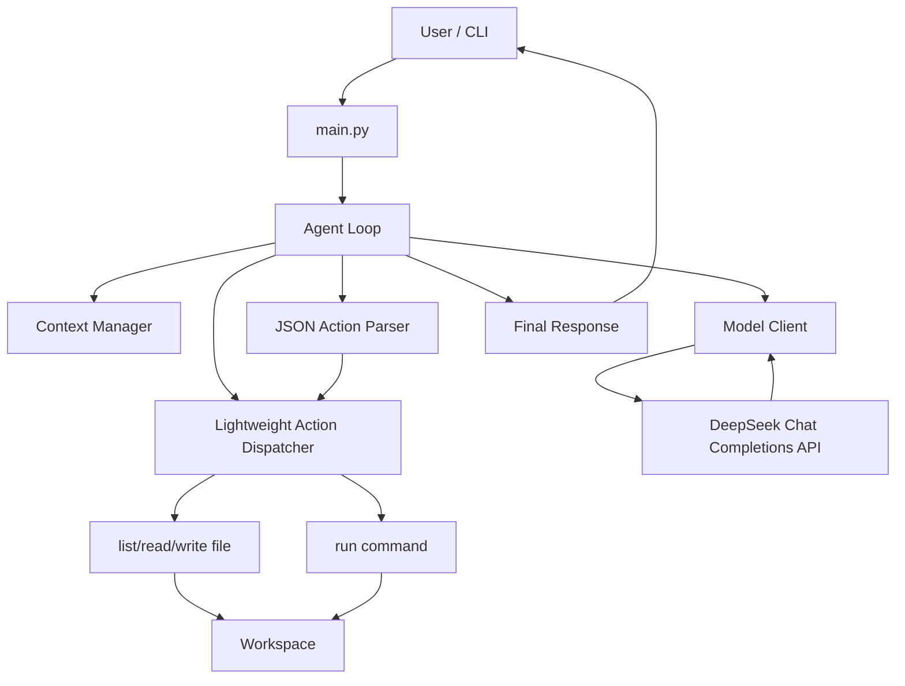
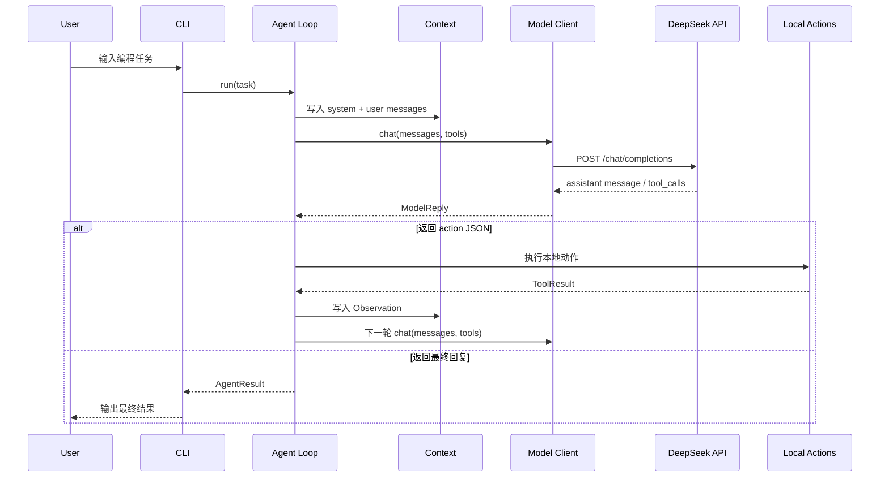
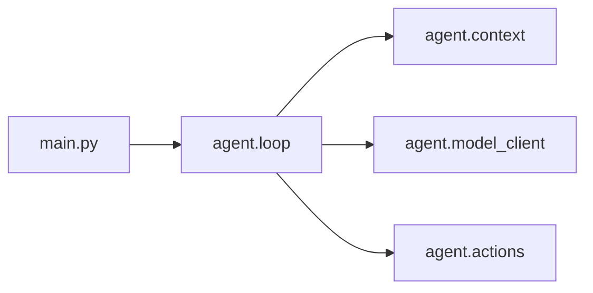

# Harness 架构图

## 1. 总体架构

## 2. Agent 执行时序

## 3. 模块依赖图

## 4. 设计说明

- Sprint 1 初版 Harness 负责把模型能力、轻量动作、本地执行和上下文组合成最小闭环。
- DeepSeek API 只负责模型推理，当前不使用正式 function tool calls。
- 文件读写、命令执行和循环控制都在本地项目中自行实现。
- 安全策略、正式工具注册和 session logs 将在 Sprint 2 加入。
