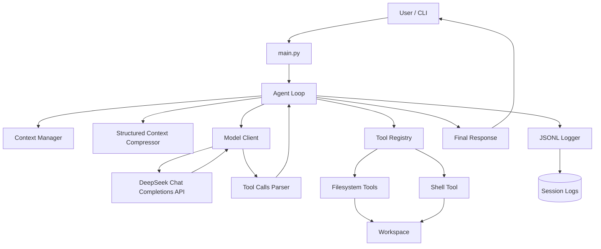
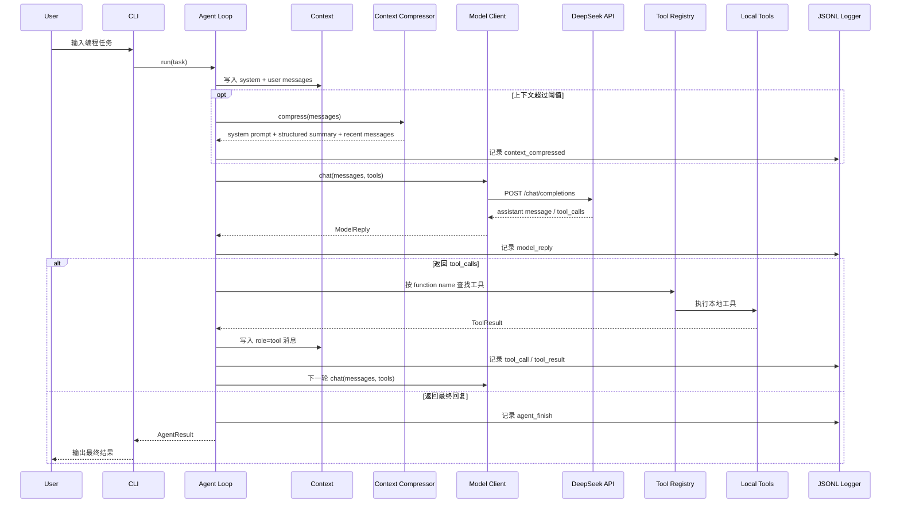
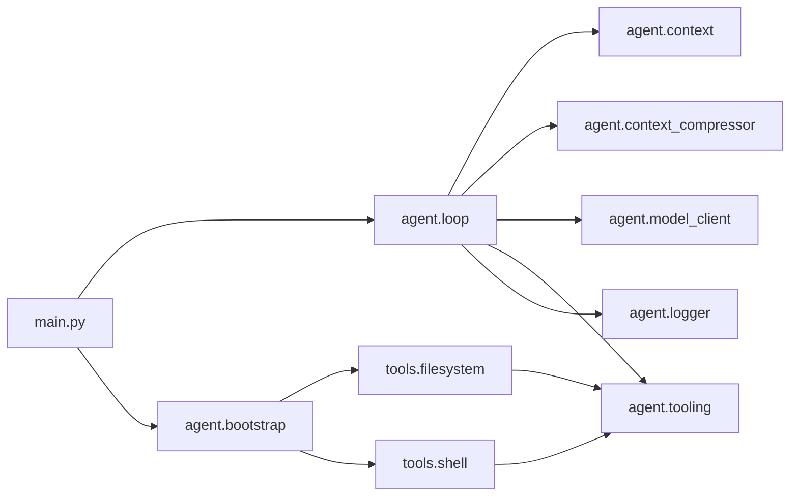

# Harness 架构图

## 1. 总体架构

## 2. Agent 执行时序

## 3. 模块依赖图

## 4. 设计说明

- Harness 负责把模型能力、正式工具系统、本地执行、上下文压缩和 JSONL 日志组合成可复盘闭环。
- DeepSeek API 负责模型推理和 function tool call 决策。
- 文件读写、命令执行、工具分发、日志和循环控制都在本地项目中自行实现。
- 结构化上下文压缩不额外调用模型，而是用规则提取任务、工具调用、修改文件、命令、错误和最近工具结果。
