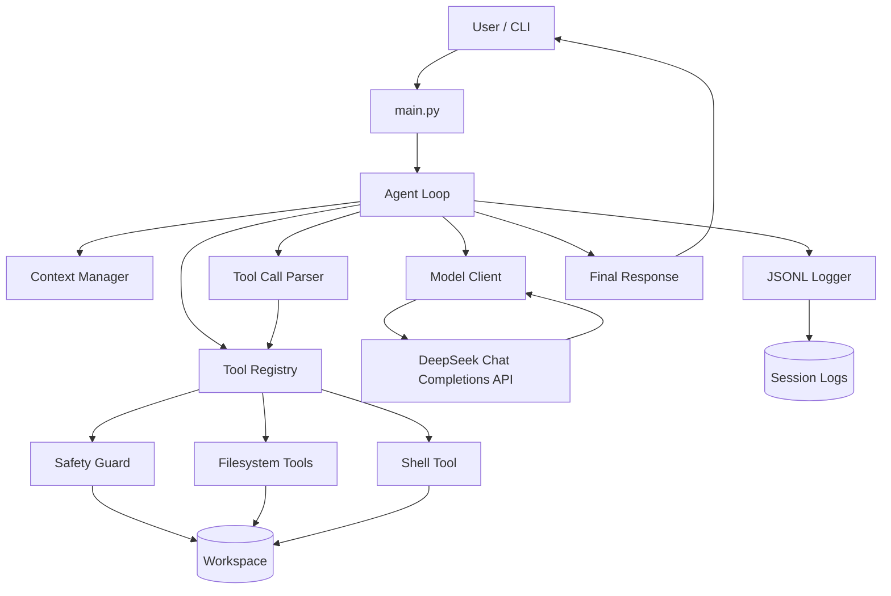
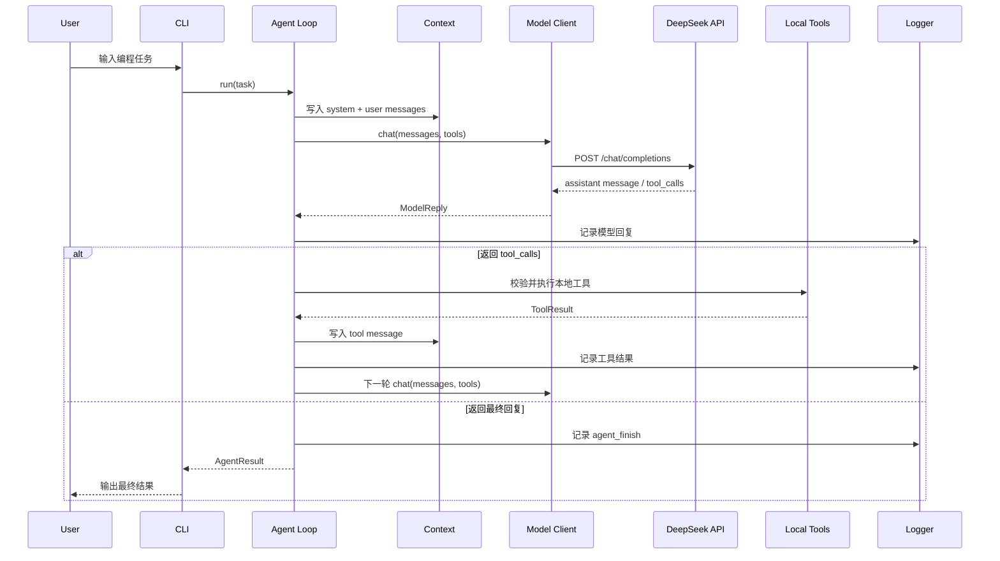
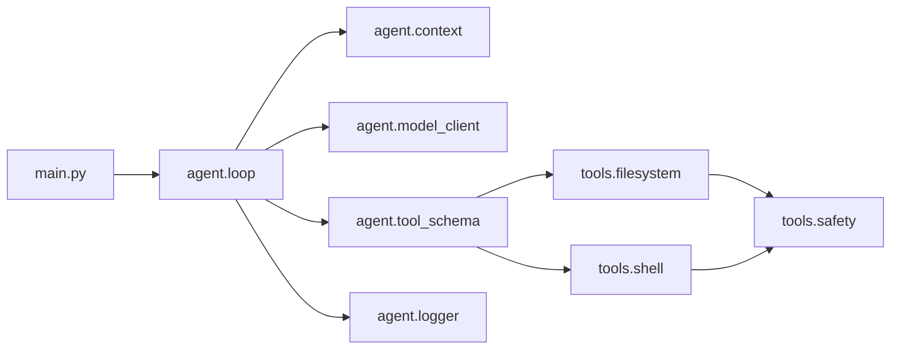

# Harness 架构图

## 1. 总体架构

## 2. Agent 执行时序

## 3. 模块依赖图

## 4. 设计说明

- Harness 负责把模型能力、本地工具、上下文和执行日志组合成一个可控运行环境。
- DeepSeek API 只负责模型推理和 function tool call 决策。
- 文件读写、命令执行、安全策略、日志和循环控制都在本地项目中自行实现。
- workspace 是所有文件和命令操作的边界。
- session logs 用于复盘每一次任务执行过程，也便于录制视频和面试说明。

